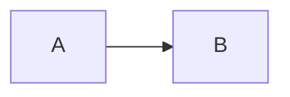
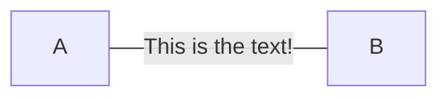
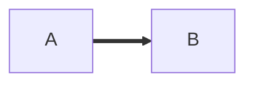
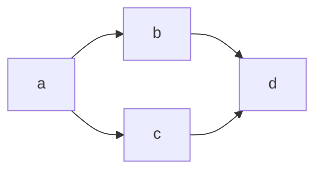
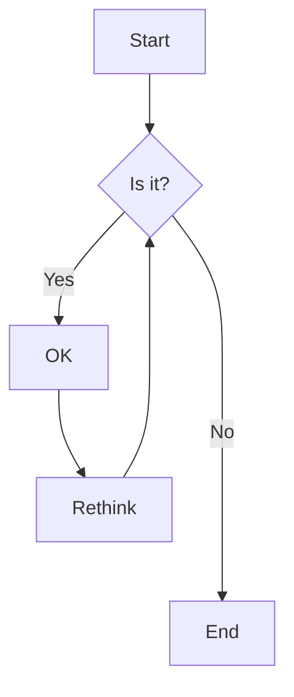
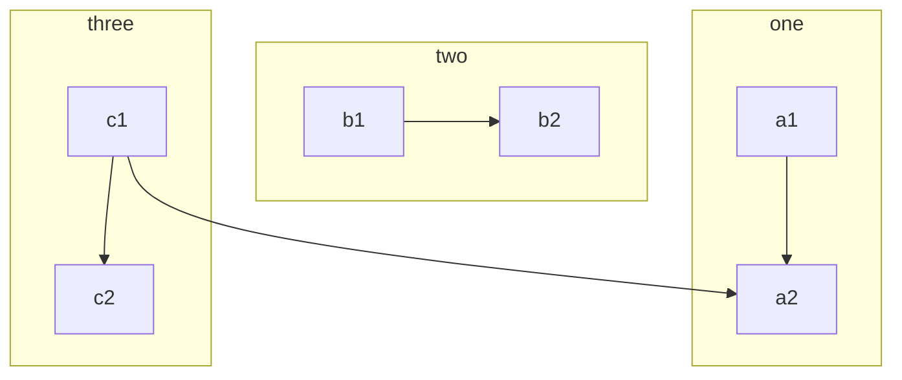
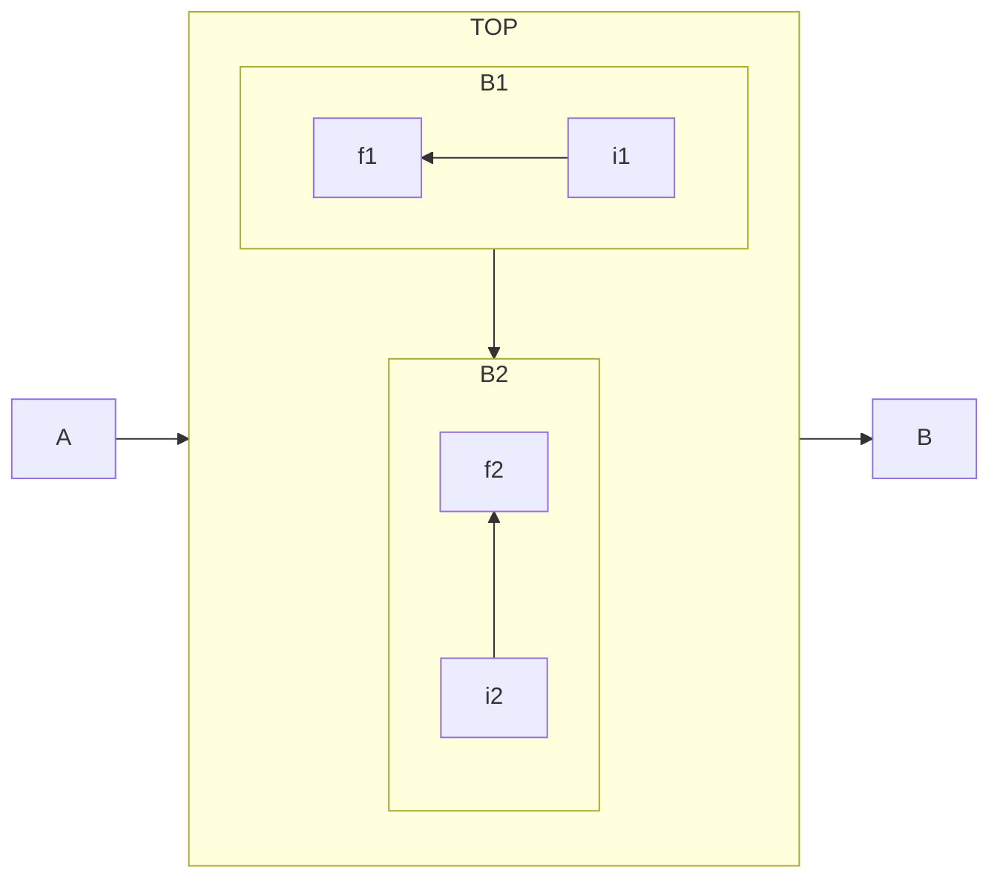

# Mermaid

Mermaid is a flowchart and graph visualization library that uses markdown syntax.

It is very powerful and easy to use. Below are some examples:

```mermaid
flowchart LR
    A-->B
```

```mermaid
flowchart LR
    A-- This is the text! ---B
```

```mermaid
flowchart LR
   A ==> B
```

```mermaid
flowchart LR
   a --> b & c--> d
```

```mermaid
flowchart TD
    A[Start] --> B{Is it?}
    B -->|Yes| C[OK]
    C --> D[Rethink]
    D --> B
    B ---->|No| E[End]
```

```mermaid
flowchart TB
    c1-->a2
    subgraph one
    a1-->a2
    end
    subgraph two
    b1-->b2
    end
    subgraph three
    c1-->c2
    end
```

```mermaid
flowchart LR
  subgraph TOP
    direction TB
    subgraph B1
        direction RL
        i1 -->f1
    end
    subgraph B2
        direction BT
        i2 -->f2
    end
  end
  A --> TOP --> B
  B1 --> B2
```
