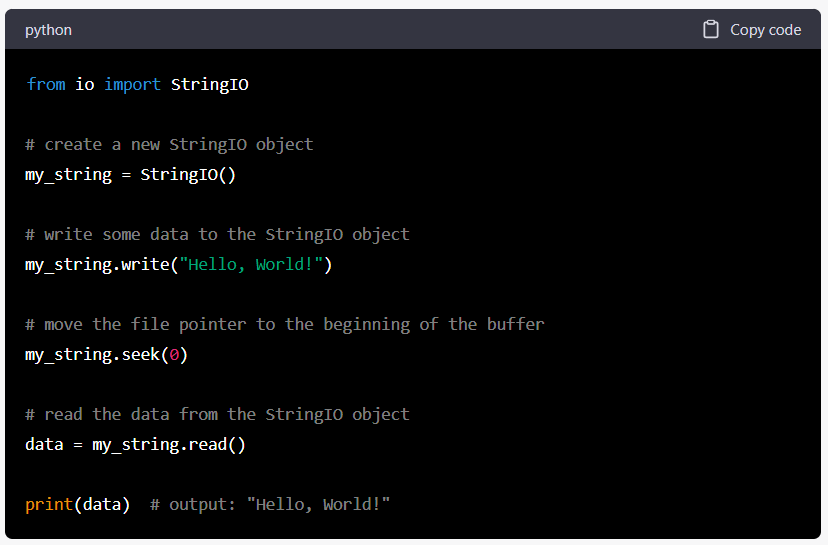

# Notes on Standard Library

## IO package

StringIO is for manipulating text in memory as if it were a file.

StringIO is useful when you need to read or write data to a string buffer as 
if it were a file, rather than creating an actual file on disk. It can be 
used to create strings that mimic file objects, allowing you to read and 
write data to them in the same way you would with a file.

The above is also true for ByteIO for binary objects
